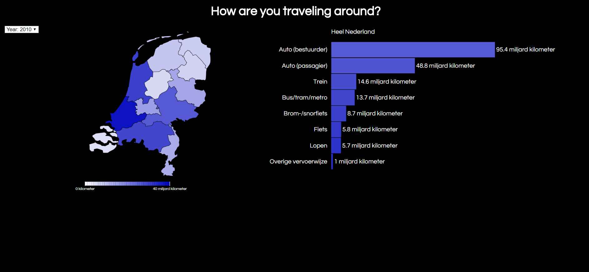

# Traveling around the Netherlands

In this assessment I used a dirty dataset, cleaned it and got multiple charts fully functioning. One chart is based [`bl.ock`](This code is based on http://bl.ocks.org/phil-pedruco/9344373 by Phil Pedruco.) by
[**@Phil Pedruco**](https://github.com/phil-pedruco) (GPL-3.0).


> My work
> [**Velomovies**](https://velomovies.github.io/fe3-assessment-3/).

## Background

For the last assessment of frontend 3 I used all my skills I learned with previous examples. With those skills I made an dashboard where you can see data about how and how much there is traveled in the Netherlands. The data is ordered by year. 

When I downloaded the data I saw directly that I had to clean it. This was an easy (but really necessary) part. In the data specification you can see how I cleaned it. 

The next step was to visualize the data in a correct way. I used a map of the Netherlands and I had to connect my data to it. The color was an array of fixed colorcodes. I changed it with my own color set (a gradient) and made sure the correct color was used for the correct province. 

The code I wrote for that was:
```javascript
.style("fill", function(d, i) {
        function locationCheck() {
          if (locations[i].properties) {
            return locations[i].properties.name + " (PV)"
          }
        }
        for (var k = 0; k < loc.length; k++) {
          if (loc[k].key == locationCheck()) {
              var color = loc[k].values[0].y2010
              return colour(color)
          }
        }
      })
```
The next step was to add another chart. I chose a bar chart and made it myself. I chose to make a new svg so that I could move them separately and to make easier selections later on. I used examples we got in the class. To load in a bar chart created the rect:
```javascript
svg2.attr("class", "chart").selectAll("rect")
      .data(data.sort(sortNumber))
      .enter()
      .append("g")
      .append("rect")
        .style("width", "0")
        .style("height", "40px")
        .attr("transform", function(d, i) { return "translate(200," + ((i + 1) * 41) + ")" })
          .transition()
          .delay(function(d, i) { return i * 100 })
          .duration(1000)
          .ease(d3.easeBounceOut)
        .style("width", function(d) { return (xChart(d) * 1) + "px" })
        .style("fill", function(d, i) { return colour(i + 25) })
```
Then I made sure the data became interactive. When a certain province is clicked it will show that data in the chart. I did that by setting an `on("click")` on the provinces and fire a function that updated the barchart
```javascript
svg.selectAll("path").attr("class", "").on("click", updateChart)

    function updateChart(d, i) {
    
        ...Code
        
    }
```
This was the basic functionality of my chart, but because I had some time left I opted to make a year selection. This turned out to be really dificult, because there where to charts to update. Next to that it had to remember the selection to use in other scenarios. In the end I made code to check what item is selected and from there it changes the data. I used the check a few times but they all look like this:
```javascript
if(sel.value == 2010) {
    ...sets something with .y2010
} else if(sel.value == 2011) {
    ...sets something with .y2011
} else if(sel.value == 2012) {
    ...sets something with .y2012
} else if(sel.value == 2013) {
    ...sets something with .y2013
} else if(sel.value == 2014) {
    ...sets something with .y2014
} else if(sel.value == 2015) {
    ...sets something with .y2015
}
```

> Next to all the big code changes I made a few little design changes. I used a google font (questrial) and made sure the visualization had a fun transition

## List of changes
* Connecting data to the map of the Netherlands
* Using a different color
* Adding a "g"
* Making a hover (with `mouseenter` and `mouseout)`
* Adding a barchart
* Updating the barchart `on("click")`
* Adding smooth transitions
* Making custom labels
* Setting transitions on labels
* Making a reset click on the `h1`
* Setting a selection tool
* Updating `on("change")` of selection
* Making sure the correct data shown in the correct graph

> Happy end! 

## Data

[`Dataset`](http://statline.cbs.nl/Statweb/publication/?DM=SLNL&PA=83497ned&D1=0&D2=a&D3=0,5-16&D4=a&HDR=T,G3&STB=G1,G2&VW=T). 

For this assessment I used an CBS dataset and cleaned it with this code:
```javascript
  var header = doc.indexOf("Vervoerwijzen")
  doc = doc.slice(header)
  end = doc.indexOf("\n", doc)
  doc = doc.slice(end).trim()
  doc = doc.replace(/"+/g, "").replace(/;+/g, ",")
  end = doc.indexOf("�")
  doc = doc.substring(0, end).trim()
  data = d3.csvParseRows(doc, map)

  function map(d, i) {
    if (d[1] == "" || d[2] == "" || d[3] == "" || d[4] == "" || d[5] == "" || d[6] == "" || d[7] == "") {
      return
    }
    return {
      transport: d[0],
      location: d[1],
      y2010: Number(d[2]),
      y2011: Number(d[3]),
      y2012: Number(d[4]),
      y2013: Number(d[5]),
      y2014: Number(d[6]),
      y2015: Number(d[7]),
    }
```
The dataset is big and has a lot of information per province and year
* `Provincie` — The data can be ordered by each province of the Netherlands
* `Jaar` — From 2010 till 2015 is data saved. I have used all data.
* `Vervoerswijze` — The way there has been traveled in the Netherlands

## Features
*   [`d3-format`](https://github.com/d3/d3-format#api-reference)
    — `d3.format([number])`
*   [`d3-array`](https://github.com/d3/d3-array)
    — `max/min`
    — `d3.push` 
*   [`d3-selection`](https://github.com/d3/d3-selection#d3-selection)
    — `d3.select`
    — `on` mouse events
*   [`d3-request`](https://github.com/d3/d3-request#api-reference)
    — `d3.tsv`
    — Loading files
*   [`d3-scale`](https://github.com/d3/d3-scale#api-reference)
    — `d3.range`,  `d3.domain`
    — scaling
*   [`d3-axis`](https://github.com/d3/d3-axis#d3-axis)
    — `d3.axisbottom`
    
    
    

## License

GPL-3.0 © Victor Zumpolle
